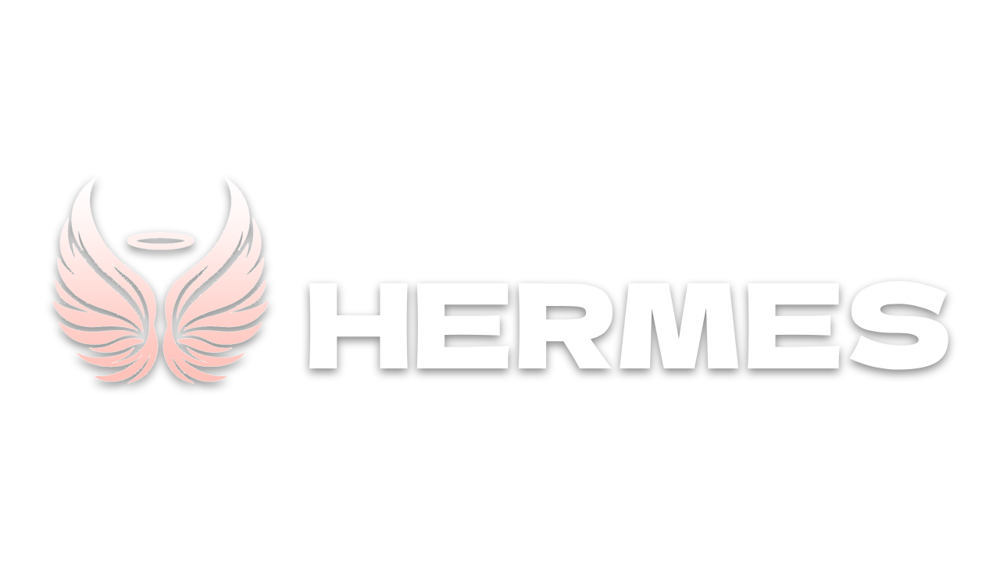

[](https://forthebadge.com)
[](https://forthebadge.com)
[](https://forthebadge.com)

**This is the server backend for the Hermes tool!**

Hermes is a powerful and lightweight tool designed to streamline the synchronization of assets from public repositories. This tool enables developers to seamlessly import various assets, including scripts, modules, or components created by other developers. With Hermes, collaboration becomes more efficient as it facilitates the sharing and integration of valuable resources across different projects.

## Features

- **Effortless Asset Sync:** Hermes simplifies the process of syncing assets from public repositories, making it easy for developers to access and integrate resources.

- **Supports Various Asset Types:** Whether it's scripts, modules, or specific components, Hermes accommodates a wide range of asset types, promoting flexibility in development workflows.

- **Lightweight and Fast:** Hermes is designed to be lightweight and fast, minimizing the impact on your development environment while maximizing productivity.

## Requirements

- [Git](https://git-scm.com/) on whatever server you're hosting this on.

## Setup

1. Clone this repo on whatever server you have.
2. ```npm install```
3. ```npm start```
4. Now copy the server URL
5. In your roblox studio, on ```ServerStorage```, create a file named ```Hermes.config```
6. In ```Hermes.config``` insert ```return "[your url]"```
7. Enjoy!

## Contact

- [Discord](https://discord.com/users/629745194920837120)

## Credits

- [Me](https://github.com/jun-ro)